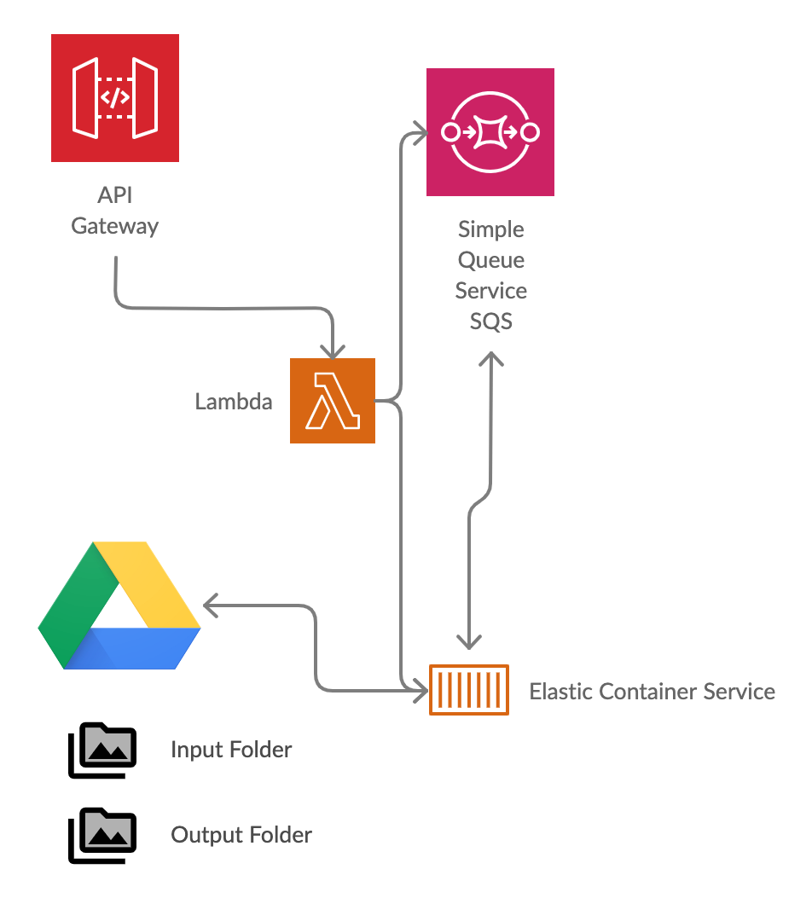

# Video Concat

With every family video, we get more ambitious. It always is a frantic finish just before we need to play the video. 

This project helps join/concatenate videos based on a sequence file. It get's triggered by API call and results in a final video published on Google Drive.

Video processing takes time (CPU intensive) and a lot of space. On Mac Air, you are severly constrained. That's why I picked AWS ECS with Fargate.

I have used Terraform to quickly bring up the infrastructure and destroy when I am done. It's perfect for infrequent use like Family events. 

I assume you have an account with AWS and have a brief understanding of AWS, Terraform, Docker, etc

## Get Started

1. Ensure you have the pre-requisites:
    1. AWS CLI [downloaded](https://docs.aws.amazon.com/cli/latest/userguide/install-cliv2.html) and configured (`aws configure`) with significant previlige to create all the infrastructure. 
    2. Terraform [downloaded](https://www.terraform.io/downloads.html) and in path. 
    3. Docker [downloaded](https://www.docker.com/get-started). (On a Mac, `brew cask install docker` worked instead of the regular `brew install docker`)

2. Generate a Service Account to access Google Drive
    1. Follow the instructions [here](https://developers.google.com/identity/protocols/oauth2/service-account) to generate the json file and store it as `cotainer/credentials.json`
    2. Remember to [enable](https://console.developers.google.com/apis/api/drive.googleapis.com/overview) Google Drive Apis for this service account.
    3. On the `output` Google Drive folder, remember to add the email of the Service Account as a collaborator with edit previleges. 

3. Create the lambda function:
    1. `npm install` in the lambda folder
    2. zip and create the package
        ```
            zip -r ../trigger.zip main.js node_modules package.json
        ```

3. Build the infrastructure
    1. The following commands have to be run in the `terraform` folder
        ```
            cd terraform
        ```
    1. Create a `my.tfvars` file with the following:
        ```
            ecr_name                   = "ss-video-concate"
            ecs_cluster_name           = "ss-video-cluster"
            ecs_service_name           = "videoconcat-service"
            ecs_task_definition_family = "VideoConcat"
            docker_image               = "705594476693.dkr.ecr.ap-south-1.amazonaws.com/ss-video-concate"
            sqs_queue_name             = "video-queue"
            api_path                   = "video-concat"
        ```
        Note: You may not have the docker_image just yet. Put in a dummy value (like above) and then update it after running the docker steps.

    2. Run terraform
        ```            
            terraform init
            terraform plan --var-file="my.tfvars" -out=tfplan
            terraform apply "tfplan"
        ```

    3. Note down the output variables from above
        ```
            base_url = "https://XXXXXXXX.execute-api.ap-south-1.amazonaws.com/test"
            queue_url = "https://sqs.ap-south-1.amazonaws.com/XXXXXXXXXXXX/video-queue"
        ```

3. Create and publish the docker image
    1. Create the docker image locally
        ```
            docker build -t video-concat .
        ```

    2. Follow the instructions on the ECR page to publish. It will substitute variables correctly.
        ```
            aws ecr get-login-password --region ap-south-1 | docker login --username AWS --password-stdin XXXXXXXXXX.dkr.ecr.ap-south-1.amazonaws.com
            docker build -t ss-video-concate .
            docker tag ss-video-concate:latest XXXXXXXXXX.dkr.ecr.ap-south-1.amazonaws.com/ss-video-concate:latest
            docker push XXXXXXXXXX.dkr.ecr.ap-south-1.amazonaws.com/ss-video-concate:latest
        ```
    3. Copy the URI / ARN for the latest docker image and update the file `my.tfvars` created in step 3.2
    
4. And you are done! If you are stuck, keep repeating steps 4.1-4.3 to get the configuration right. 

5. Test your setup by creating a POST request to your API:

    1. Find the input and output folder IDs. It's part that comes after the *folders* in a Google Drive link
    ```
        https://drive.google.com/drive/folders/XXXXXXXXXXXXXgtj9wZG3HIcb6b1dLLqg
    ```
    
    2. Create a sequence file by mention each file name on a separate line. Remember that the sequence file should be a simple text file and not Google Docs or Doc or Docx or any other complex format. (We will be doing `cat sequence` in our script.)
    ```
        Opening.mp4    
        Video 1.mp4
        Video 2.mp4        
        Credits.mp4        
    ```
    
    3. Generate the video by calling the API:
    ```
        curl --location --request POST 'https://XXXXXXXX.execute-api.ap-south-1.amazonaws.com/test/video-concat/' \
            --header 'Content-Type: application/json' \
            --data-raw '{
                "input_folder": "XXXXXXXXXXTgtj9wZG3HIcb6b1dLLqg",
                "output_folder": "XXXXXXXXXjjLvduXwQM4j5lPHY7_6z6a",
                "sequence_file_name": "sequence",
                "output_file_prefix": "Short-Video-"
            }'
    ```
    4. Check CloudWatch logs to see if there are any errors in Lambda or ECS. If not, you will see your video in the `output` folder

6. When done you can destroy your infrastructure:
    ```
        terraform plan --var-file="my.tfvars" -destroy -out=tfplan
        terraform apply "tfplan"
    ```

### How does this work?



1. User's `POST` request is passed on to a Lambda Function via API Gateway
2. The Lambda Function posts an event to SQS Queue and updates the ECS service's desired count to 1
3. The ECS container reads from the queue in a while loop, until there are no messages.
4. The ECS container downloads all the files in the `input` folder. It expects the sequence file to be present here.
5. It uses `ffmpeg` to concatenate the videos using [ffmpeg filters](https://ffmpeg.org/ffmpeg-filters.html#concat)
6. It then pushes the final video to the `output` folder
7. It then deletes the message from the queue, and checks for another message

### Further Reading

I found the following tutorials and articles very helfpul while working on this project:

1. [Better Together: Amazon ECS and AWS Lambda | AWS Compute Blog](https://aws.amazon.com/blogs/compute/better-together-amazon-ecs-and-aws-lambda/)
2. [How to manage Terraform state. A guide to file layout, isolation, and… | by Yevgeniy Brikman | Gruntwork](https://blog.gruntwork.io/how-to-manage-terraform-state-28f5697e68fa)
3. [Copy all files in a folder from Google Drive to AWS S3 (Example)](https://coderwall.com/p/rckamw/copy-all-files-in-a-folder-from-google-drive-to-aws-s3)
4. [Docker Images : Part I - Reducing Image Size](https://www.ardanlabs.com/blog/2020/02/docker-images-part1-reducing-image-size.html)
5. [Fargate as Batch Service. AWS Fargate can be a useful service for… | by Ava Chen | Aug, 2020 | Medium](https://medium.com/@avachen2005/fargate-as-batch-service-31a896ec1917)
6. [Serverless Applications with AWS Lambda and API Gateway | Terraform - HashiCorp Learn](https://learn.hashicorp.com/tutorials/terraform/lambda-api-gateway)
7. [Why does AWS Lambda need to pass ecsTaskExecutionRole to ECS task](https://serverfault.com/questions/945596/why-does-aws-lambda-need-to-pass-ecstaskexecutionrole-to-ecs-task)
    * https://stackoverflow.com/questions/58686844/ecs-task-not-starting-stopped-cannotpullcontainererror-error-response-from
    * https://medium.com/@paweldudzinski/creating-aws-ecs-cluster-of-ec2-instances-with-terraform-893c15d1116