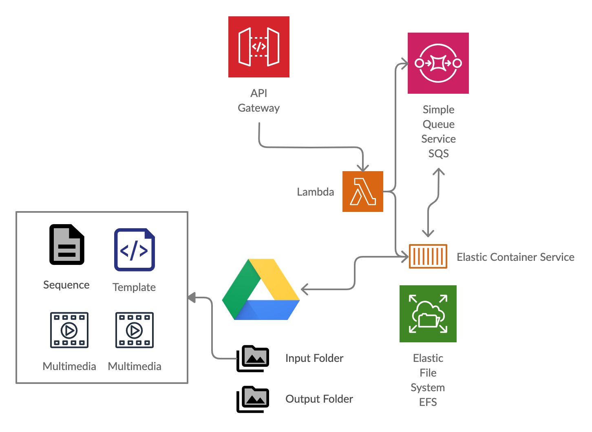

# Video Concat

With every family video, we get more ambitious. It always is a frantic finish just before we need to play the video. 

This project helps join/concatenate videos based on a sequence file. It get's triggered by API call and results in a final video published on Google Drive.

Video processing takes time (CPU intensive) and a lot of space. On Mac Air, you are severly constrained. That's why I picked AWS ECS with Fargate.

I have used Terraform to quickly bring up the infrastructure and destroy when I am done. It's perfect for infrequent use like Family events. 

We assume you have an account with AWS. We assume you have a brief understanding of AWS, Terraform, Docker, etc

## Get Started

1. Ensure you have the pre-requisites:
    1. AWS CLI downloaded and configured: `aws configure`
    2. Terraform downloaded
    3. Docker downloaded. On a Mac, `brew cask install docker` worked instead of the regular `brew install docker` 

2. Build the infrastructure
    1. The following commands have to be run in the `terraform` folder
        ```
            cd terraform
        ```
    1. Create a `my.tfvars` file with the following:
        ```
            ecr_name                   = "ss-video-concate"
            ecs_cluster_name           = "ss-video-cluster"
            ecs_service_name           = "videoconcat-service"
            ecs_task_definition_family = "VideoConcat"
            docker_image               = "705594476693.dkr.ecr.ap-south-1.amazonaws.com/ss-video-concate"
            sqs_queue_name             = "video-queue"
        ```
        Note: You may note have the docker_image just yet. Put in a dummy value () and then update it after running the docker steps.

    2. Run terraform
        ```            
            terraform init
            terraform plan --var-file="my.tfvars" -out=tfplan
            terraform apply "tfplan"
        ```

    3. Note down the output variables from above
        ```
        ```

3. Create and publish the docker image
    1. Create the docker image locally
        ```
            docker build -t video-concat .
        ```

    2. Follow the instructions on the ECR page to publish
        ```

        ```

### Deep Dive



